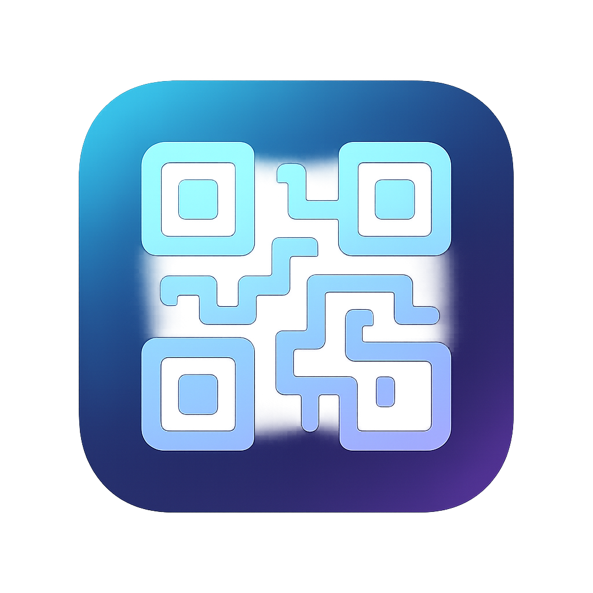

<div align="center">
  

  # Custom QR Code Generator

  Exact, privacy-aware SVG QR generation for the terminal and browser.
</div>

The project creates standard QR Code Model 2 symbols through a vendored Project
Nayuki encoder. The terminal supports guided text, URL, email, phone, WiFi, and
SMS payloads. The browser currently supports exact raw text. Both surfaces use
one validation, encoding, scanability, and SVG-rendering core.

Milestone C is a release candidate, not yet a universal scanning claim. The
independent ZXing matrix is automated; the representative real-device matrix in
[`docs/milestone-c/DEVICE_MATRIX.md`](docs/milestone-c/DEVICE_MATRIX.md) must be
completed before the milestone is marked shipped.

## What it does

- Preserves arbitrary valid Unicode exactly; it does not silently normalize text.
- Correctly percent-encodes email/SMS fields and escapes WiFi reserved characters.
- Exposes requested and actual error correction when the encoder safely boosts it.
- Produces deterministic, minimal, well-formed SVG with no external doctype or
  active/external content.
- Rejects unsafe contrast/border choices and visibly warns about reduced quiet
  zones, accepted low contrast, and reversed polarity.
- Hides exact payloads from terminal output and HTTP metadata by default.
- Sanitizes CLI output names, confines them to `saved/`, and never overwrites an
  existing file during collision handling.
- Rejects malformed, oversized, and unknown API input with stable 4xx errors.
- Independently decodes the serialized SVG geometry across all payload types,
  requested correction levels, Unicode, large versions, and capacity boundaries.

## Requirements

- Python 3.10–3.14
- A modern browser for the web surface

The QR encoder has no network dependency. Flask and Gunicorn are needed only for
the web surface. Pillow and ZXing-C++ are development/test dependencies, never
production runtime dependencies.

## Install

```bash
git clone https://github.com/juansilvadesign/Custom-QR-Code-Generator.git
cd Custom-QR-Code-Generator
python -m venv .venv
```

Activate the environment:

```bash
# macOS/Linux
source .venv/bin/activate

# Windows PowerShell
.venv\Scripts\Activate.ps1
```

Install runtime dependencies:

```bash
python -m pip install -r requirements.txt
```

For development and the independent decoder suite:

```bash
python -m pip install -r requirements-dev.txt
```

## Terminal

```bash
python main.py
```

The prompts collect a structured payload, ECL, strict final colors, quiet-zone
border, and output name. Friendly CLI color forms—`#RRGGBB`, `RRGGBB`,
`rgb(r,g,b)`, and common names—are converted to the core's strict format.

By default the terminal prints a content-hidden summary only. For payloads that
may contain private text, credentials, addresses, or numbers, exact output is
shown only after an explicit reveal prompt. SVGs are created with mode `0600`
where the operating system supports it, WiFi password entry is hidden, and files
are saved under `saved/` as:

```text
name.svg
name (1).svg
name (2).svg
```

`run.bat` performs the same CLI setup/launch flow on Windows. It detects `.venv`
and retains `.env` only for legacy environments; no template copy or path editing
is needed.

## Browser and Flask API

Development server:

```bash
flask --app app run --debug
```

Production-style server on Unix:

```bash
gunicorn app:app
```

Open <http://127.0.0.1:5000>. The browser sends exact text to the same core used
by the terminal, shows QR metadata and warnings, previews the safe generated SVG,
and downloads it without server-side persistence.

The endpoint accepts `POST /api/generate` with `application/json` and a JSON
object. Example:

```json
{
  "payloadType": "text",
  "fields": {"text": "Hello, 世界"},
  "errorCorrection": "M",
  "foreground": "#000000",
  "background": "#FFFFFF",
  "border": 4,
  "outputName": "hello.svg"
}
```

Only `payloadType` and `fields` are required. The API supports every canonical
payload type, although guided structured controls in the browser are planned for
Milestone D. See [`docs/GENERATION_CONTRACT.md`](docs/GENERATION_CONTRACT.md) for
the exact field rules, limits, response metadata, warnings, and error envelope.
This is the bundled same-origin application endpoint, not a versioned public API
compatibility promise.

All API responses use `Cache-Control: no-store`. The public response deliberately
omits the exact payload and sensitive field values. Flask does not log request
bodies or returned SVG content, and unexpected errors return a generic code
without exception strings or paths. Wildcard CORS is not enabled; the bundled UI
is same-origin.

## Payload semantics

| Type | Terminal | API | Browser controls | Encoded form |
| --- | :---: | :---: | :---: | --- |
| Text | Yes | Yes | Yes | Exact text |
| URL | Yes | Yes | Not yet | HTTP(S), adding `https://` only when absent |
| Email | Yes | Yes | Not yet | `mailto:` with percent-encoded subject/body |
| Phone | Yes | Yes | Not yet | `tel:` with conservative formatting removal |
| WiFi | Yes | Yes | Not yet | Escaped `WIFI:` payload with WPA/WEP/nopass/hidden |
| SMS | Yes | Yes | Not yet | `sms:` with percent-encoded body |

Validation checks structure, not real-world existence, deliverability, network
availability, destination safety, or phone ownership.

## Scanability policy

The safe default is black modules on white with a four-module quiet zone.

- Contrast below 3.0:1: rejected.
- Contrast below 4.5:1 but at least 3.0:1: warning.
- Light modules on dark: warning because scanner support varies.
- Border 0–1: rejected; 2–3: warning; 4+: accepted.
- Metadata suggests eight rendered pixels per total QR module, but does not claim
  one universal physical or print size.

These checks are guardrails, not accessibility scores or guarantees. Test the
downloaded artifact in its final size, medium, lighting, and target scanner.

## Payload and request limits

The built payload uses conservative UTF-8 byte ceilings: L 2,953; M 2,331;
Q 1,663; H 1,273. The HTTP JSON body limit is 16,384 bytes. Exceeding the body
limit returns 413; exceeding QR capacity returns a stable 422 error. Empty or
invalid structured fields use their own error codes.

## Test and release checks

```bash
python -m unittest discover -s tests -v
python -m pip check
pip-audit -r requirements.txt
pip-licenses --from=mixed --packages Flask gunicorn Pillow zxing-cpp
```

The suite covers unit, API, CLI/filesystem, parity, deterministic SVG/XML,
security boundaries, and independent exact decoding. CI exercises Python
3.10–3.14 on Linux plus endpoint versions on Windows and macOS. A release also
requires the manual device matrix; skipped/manual evidence cannot be replaced by
an SVG-generation success.

## Project structure

```text
app.py                         Flask adapter
main.py                        interactive terminal adapter
qr_contract.py                 canonical request/result/error values
qr_payloads.py                 structured payload builders
qr_core.py                     validation, encoding, scanability, SVG rendering
qr_files.py                    safe filename and exclusive output handling
qrcodegen.py                   vendored Project Nayuki encoder
static/js/app.js               browser adapter
templates/index.html           browser shell
tests/                         release suite and exact fixture catalog
docs/GENERATION_CONTRACT.md    complete behavior contract
docs/ENCODER_PROVENANCE.md     source, checksum, license, update procedure
render.yaml                    Render deployment definition
run.bat                        Windows CLI launcher
```

Encoder origin and the byte-for-byte checksum are recorded in
[`docs/ENCODER_PROVENANCE.md`](docs/ENCODER_PROVENANCE.md). Do not update the
vendored file without the full decoder and device matrix.

## Deployment

`render.yaml` installs `requirements.txt` and runs `gunicorn app:app`. The app is
stateless and does not write generated payloads or SVGs on the server. Milestone E
still owns local frontend assets, a restrictive CSP, operational abuse controls,
and deployment smoke/rollback work; the current hosted UI continues to load its
React/Tailwind runtime from CDNs.

## Contributing and license

See [`CONTRIBUTING.md`](CONTRIBUTING.md) for executable setup, test, audit, and
release expectations. Application code and the vendored encoder are MIT licensed;
the upstream encoder notice is retained inside `qrcodegen.py`.
